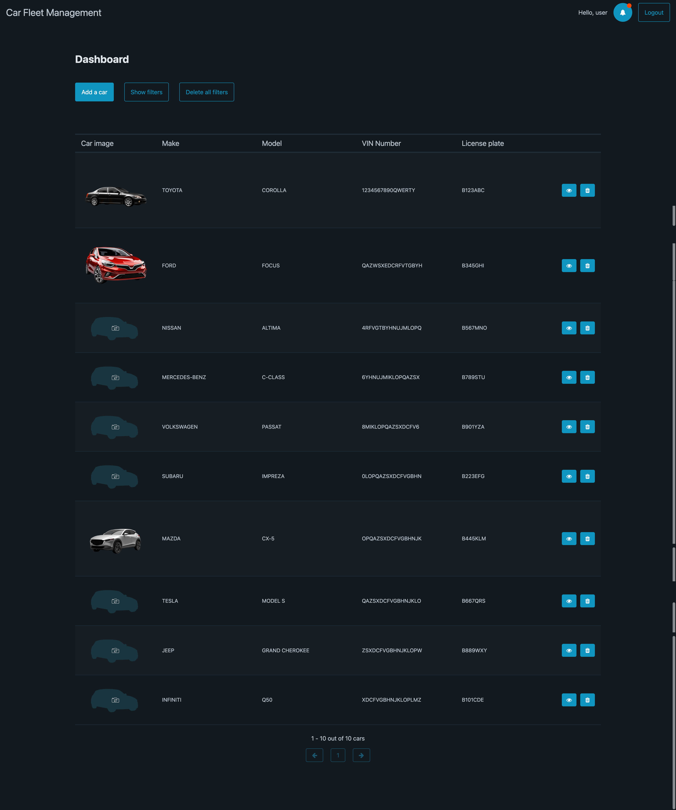
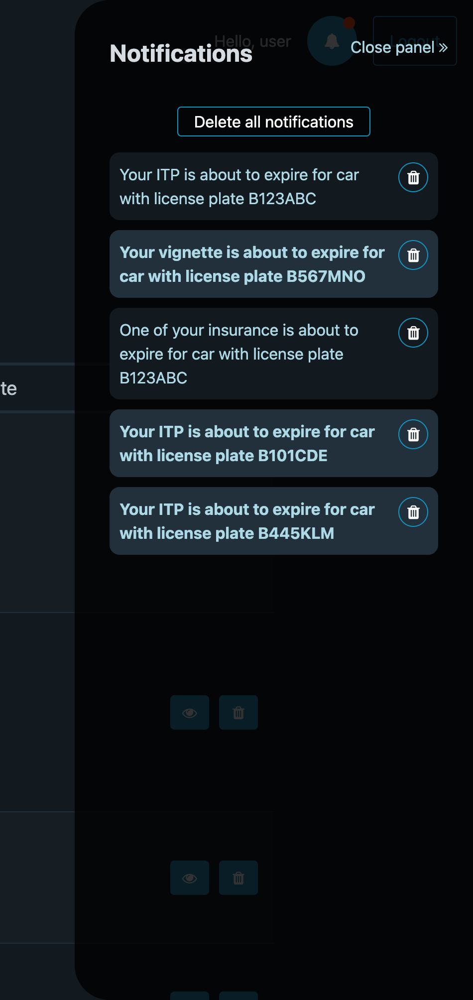
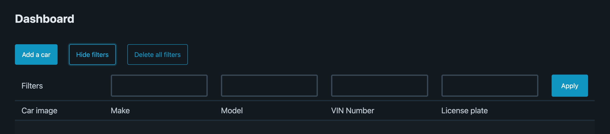
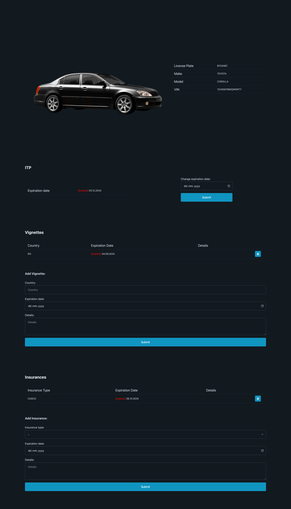

    <h3> Car Fleet Management System </h3> 

## Introduction
Fleet is a car fleet management system that allows companies to manage their car fleet (add, remove, update and search for cars) and get notifications about expiring documents (insurance, technical inspection, etc.).

## Technologies
- HTML, CSS, JavaScript + AJAX
- PHP
- MySQL

## Features
- login and registration
- add, remove, update and search for cars
- get notifications about expiring documents

## Installation
1. Clone the repository
2. Import the `dbStructure.sql` file into your MySQL database
3. Update the `config.php` file with your database credentials
4. Run the application

## Screenshots
- Dashboard

---

- Notifications panel

---

- Filters
    
---

- Car Documents page

---

## Future Improvements
- SMS & Email notifications
- Responsive design
- Real-time car tracking